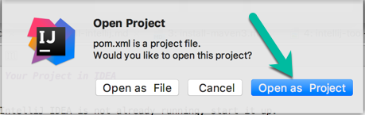
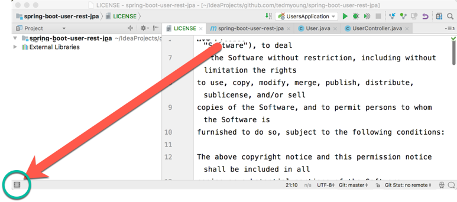
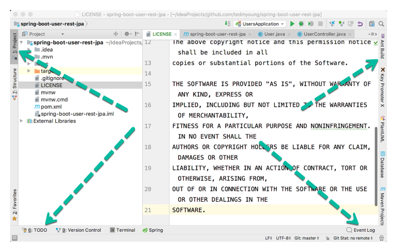
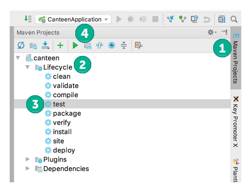
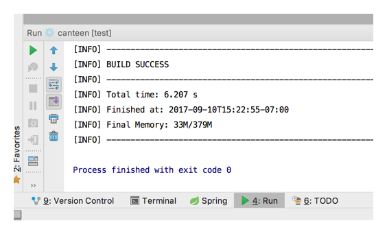

# Validating Your Setup

This lab is to ensure that all of the tools that we'll be using during this week's labs are correctly set up on your machine.

## Pre-Requisites

### Developer Setup

If you haven't already done this as part of your developer on-boarding, you'll want to look at this page for Maven/Artifactory setup as well as Git and Proxying information.

Go to: https://visawiki.trusted.visa.com/display/VDP/New+Developer+Onboarding+Checklist

Search the page for the sections of interest (below) and follow those instructions:

#### Sections of Interest:

- Proxy Settings in Terminal
- Git Config Settings
- Maven Settings -- **Note:** The Maven `settings.xml` must go in your user directory
  * On Windows, this is in the `.m2` directory underneath `C:\Users\YOUR_USER_NAME`, e.g., `C:\Users\tedyoung\.m2\settings.xml`
  * On Mac/Linux, this is in `~/.m2`

----

You should already have the following tools installed on your machine from the "self-paced learning" pre-course work.
If you don't have them installed, follow the links next to each item:

* Git - [installing git](https://github.com/ted-ncg/austin-spl-june-26/blob/master/install-git.md)
* curl - [installing curl](https://github.com/ted-ncg/austin-spl-june-26/blob/master/install-curl.md)
* Java 8 - [installing Java](https://github.com/ted-ncg/austin-spl-june-26/blob/master/install-java8.md)
* Maven 3 - [installing Maven](https://github.com/ted-ncg/austin-spl-june-26/blob/master/install-maven3.md)
* IntelliJ IDEA - [installing IDEA](https://github.com/ted-ncg/austin-spl-june-26/blob/master/install-intellij.md) -- **NOTE** install the *Ultimate* Edition for the 30-day trial as it has Spring-specific tools.

----

# Lab Instructions

## Clone the Canteen Repository

1. Open a command prompt or terminal

1. Change to your projects directory

1. Clone the project repository from GitHub to your machine by doing:

   `git clone https://github.com/ted-ncg/canteen-starter`

   * If you run into proxying issues, see [proxying git](#proxying-git) for more info
   * If you are still having trouble, download and unzip the project instead of using Git to pull it.

## Use Maven to Run the Test

1. Change to the directory holding the project:

   ```
   $ cd canteen-starter
   ```
    
1. Run the `test` task in Maven:

   ```
   $ mvn test
   ```

1. Maven will download a **lot** of files, so this **will take a little while (10-20 minutes)**!
   Once it's finished downloading the files, it will compile the code and run the 1 test in the project.
   If all goes well, you should eventually see something like:
   
   ```
   Results :

   Tests run: 1, Failures: 0, Errors: 0, Skipped: 0

   [INFO] ------------------------------------------------------------------------
   [INFO] BUILD SUCCESS
   [INFO] ------------------------------------------------------------------------
   [INFO] Total time: 4.706 s
   [INFO] Finished at: 2017-09-11T10:39:51-07:00
   [INFO] Final Memory: 20M/437M
   [INFO] ------------------------------------------------------------------------
   ```

   If you see the above, continue to the next section.
   If not, please ask the instructor for help!

## Open the Project in IntelliJ IDEA

1. Launch IntelliJ IDEA

1. Open the pom.xml file, either:

   * If you see the Welcome screen, choose `Open`

   Otherwise...

   * From the `File` menu, choose the `Open...` item to open the pom.xml (*don't* use Import) in the `austin-canteen` project directory.

1. IDEA will then ask you how to open this file. Since we want it to be a new **project**, click `Open as Project`.

    

1. The project will load and IDEA will do some indexing, which may take a minute (or more).

### Run the Test in IDEA

1. Once the indexing completes, navigate to the `CanteenApplicationTest` class -- **Note:** this is the *test* class, not the application class.

1. Click on the green arrow next to the left of the class name

1. The test should pass (be green)

### Run the Test in IDEA Using Maven

1. Turn on the tool window buttons by clicking on the icon in the lower-left:

    

1. You should now see buttons along the left, bottom, and right edges:

    

1. Find the `Maven Projects` tab, which should be on the right-side edge of the window, 
   and click on it (1) to open up the tool window.

    

1. Open the `canteen` project tree, then open the `lifecycle` tree (2).

1. Click on the `test` item (3) and then click the green arrow (4) to execute the test task.

1. If all goes well, you'll see the test run and pass in a console as shown below:

    

----

## Add Your Name [OPTIONAL!]

1. Create a new branch with **your name** and make it the current branch (`checkout`).
    You can do this from the command-line by typing (replace `yourname` with, well, *your* name):
    
    `git checkout -b yourname`

    You should see:
     
    `Switched to a new branch 'yourname'`
    
1. Open up the `README.md` file inside of IDEA.

1. Underneath where it says `## Participants`, add your name.

1. From with IDEA (or via the command-line):

   * Add the file to Git (`git add README.md`)
   * Commit the file (`git commit -m 'Added Ted Young to participants.'`)
   * Push the file up to GitHub (`git push --set-upstream origin <branch name here>`) -- remember to use the branch name that you created in the first step.

**NOTE:** You *will* run into a permissions issue. THAT IS OK! Call the instructor over when you run into it.


----

----

### Maven Proxying

**NOTE:** Only follow these directions if the developer onboarding page *didn't* work for you.

If you find that you need to use a proxy to access the various dependencies, you'll need to add the following to your settings.xml file:

1. Open or create the settings.xml file found in the .m2 directory located in your home/user directory, e.g., ~/.m2/settings.xml
2. Add the following, filling in the protocol (http or https to connect to the proxy), host, port, username, and password as appropriate:

```
    <settings xmlns="http://maven.apache.org/SETTINGS/1.0.0"
      xmlns:xsi="http://www.w3.org/2001/XMLSchema-instance"
      xsi:schemaLocation="http://maven.apache.org/SETTINGS/1.0.0
                          https://maven.apache.org/xsd/settings-1.0.0.xsd">

      <proxies>
        <proxy>
          <id>VisaHttpProxy</id>
          <active>true</active>
          <protocol>http</protocol>
          <host>proxy.visa.com</host>
          <port>80</port>
          <nonProxyHosts>localhost|127.0.0.1|*.visa.com</nonProxyHosts>
        </proxy>
        <proxy>
          <id>VisaHttpsProxy</id>
          <active>true</active>
          <protocol>https</protocol>
          <host>proxy.visa.com</host>
          <port>443</port>
          <nonProxyHosts>localhost|127.0.0.1|*.visa.com</nonProxyHosts>
        </proxy>
      </proxies>

    </settings>
```

   Note: If you already had a settings.xml file, then just add the <proxies> section to it, leaving the rest of the file as-is.

----

## Proxying Git

**NOTE:** Only follow these directions if the developer onboarding page didn't work for you.

If **git** can't connect (some error like `unable to access '...'` or `Couldn't resolve host '...'`), then you may need to set up a proxy like this:

```
git config --global http.proxy http://userproxy.visa.com:80
git config --global http.sslVerify false
```

```
export http_proxy=userproxy.visa.com:80
export https_proxy=userproxy.visa.com:443 

or

set HTTP_PROXY=userproxy.visa.com:80
set HTTPS_PROXY=userproxy.visa.com:443
```

Where the username, password, server, etc. are however your proxy is set up.
