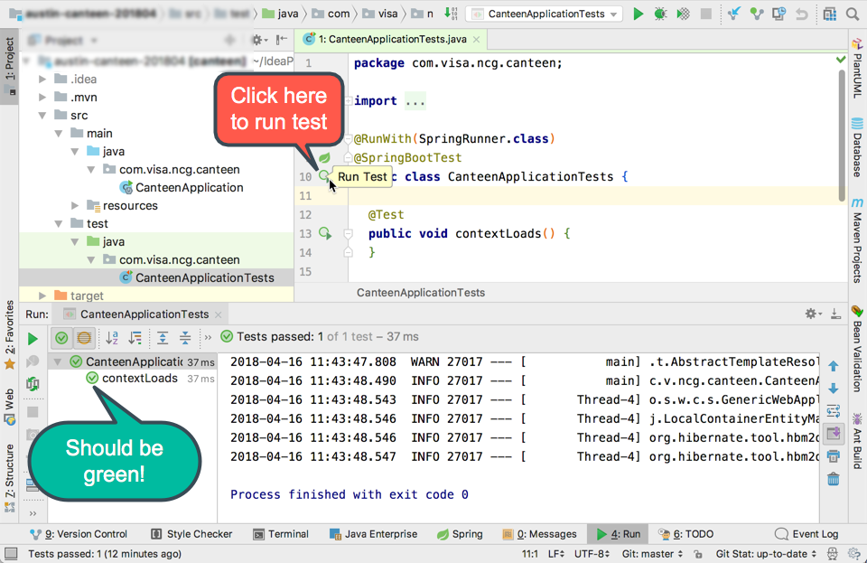

# Validating Your Setup

### Short Link: `http://bit.ly/ncg-setup`

In this lab you'll ensure that all of the tools that you'll be using during this week's labs are correctly set up on your machine.

> Yes, this process can be a bit frustrating, but stick with it and ask your neighbors or the instructor for help!


## Pre-Requisites

### Developer Setup

If you haven't already done this as part of your developer on-boarding, you need to look at this page for **Maven-Artifactory** setup as well as **Git** and **Proxying** information.

Go to: https://visawiki.trusted.visa.com/display/VDP/New+Developer+Onboarding+Checklist

Search the page for the sections of interest (below) and follow those instructions:

#### Sections of Interest:

- Proxy Settings in Terminal
- Git Config Settings
- Maven Settings -- **Note:** The Maven `settings.xml` must go in your user directory
  * On Windows, this is in the `.m2` directory underneath `C:\Users\YOUR_USER_NAME`, e.g., `C:\Users\tedyoung\.m2\settings.xml`
  * On Mac/Linux, this is in `~/.m2`

----

You should already have the following tools installed on your machine from the pre-course work.
If you don't have them installed, follow the links next to each item:

* Git - [installing git](https://github.com/ted-ncg/austin-spl-june-26/blob/master/install-git.md)
* Java 8 - [installing Java](https://github.com/ted-ncg/austin-spl-june-26/blob/master/install-java8.md)
* Maven 3 - [installing Maven](https://github.com/ted-ncg/austin-spl-june-26/blob/master/install-maven3.md)
* IntelliJ IDEA - [installing IDEA](https://github.com/ted-ncg/austin-spl-june-26/blob/master/install-intellij.md) -- **NOTE** install the *Ultimate* Edition for the 30-day trial as it has Spring-specific tools.
* curl (*optional*) - [installing curl](https://github.com/ted-ncg/austin-spl-june-26/blob/master/install-curl.md)

----

# Lab Instructions

## Validate Java Install

Let's make sure the correct version of Java is installed:

1. Open a command prompt or terminal

1. Type `javac -version`

   You should get something like:
   
   ```
   javac 1.8.0_161
   ```

   If you don't then check that you typed the command correctly, or double-check your Java installation (see above).

## Clone the Canteen Repository

1. Change to your projects directory, or make one for this training class, e.g.:

   * Windows: `mkdir C:\training` and then `cd \training`
   * macOS: `mkdir ~/training` and then `cd ~/training`

1. Clone the project repository from BitBucket to your machine by doing:

    ```bash
    git clone https://bitbucket.org/tedmyoung/austin-201808-canteen.git
    ```

   * **ssh:** If you know what `ssh` is and can use it, you can do:
       
       ```bash
       git clone git@bitbucket.org:tedmyoung/austin-201808-canteen.git
       ```

   **NOTE:** If you run into proxying issues, see [proxying git](#proxying-git) for more info

   * If you are still having trouble, download and unzip the project instead of using Git to pull it.
   
     * You can do this by opening up a browser, and going to this URL: 
     
       ```
       https://bitbucket.org/tedmyoung/austin-201808-canteen/downloads/
       ```
       
       Then click on **Download Repository** and unzip the file.

## Use Maven to Run the Test

Let's run the test using Maven from the command line.

1. Change to the directory holding the project:

   ```
   $ cd austin-201808-canteen.git
   ```
    
1. Run the `test` task in Maven:

   ```
   $ mvn test
   ```

1. Maven will download a **lot** of files, so this **will take a little while (10-20 minutes)**!
   Once it's finished downloading the files, it will compile the code and run the 1 (and only) test in the project.
   If all goes well, you should eventually see something like:
   
   ```
   Results :

   Tests run: 1, Failures: 0, Errors: 0, Skipped: 0

   [INFO] ------------------------------------------------------------------------
   [INFO] BUILD SUCCESS
   [INFO] ------------------------------------------------------------------------
   [INFO] Total time: 4.706 s
   [INFO] Finished at: 2017-09-11T10:39:51-07:00
   [INFO] Final Memory: 20M/437M
   [INFO] ------------------------------------------------------------------------
   ```

   If you see the above, continue to the next section.
   If not, please ask the instructor for help!

## Open the Project in IntelliJ IDEA

Now that all the dependencies have been downloaded and the project works, let's open it up in IDEA.

1. Launch IntelliJ IDEA

1. Open the pom.xml file, either:

   * If you see the Welcome screen, choose `Open`

   Otherwise...

   * From the `File` menu, choose the `Open...` item to open the pom.xml (*don't* use Import) in the `austin-201808-canteen.git` project directory.

1. IDEA will then ask you how to open this file. Since we want it to be a new **project**, click `Open as Project`.

    

1. The project will load and IDEA will do some indexing, which may take a minute (or more).

### Run the Test in IDEA

1. Once the indexing completes, navigate to the `CanteenApplicationTest` class -- **Note:** this is the *test* class, not the application class.

1. Click on the green arrow next to the left of the class name

1. The test results will show up in a bottom window pane and should be green, i.e., they passed.
   You should see something like this:
   
   

<br/><br/>

### Run the Test in IDEA Using Maven

1. Turn on the tool window buttons by clicking on the icon in the lower-left:

    

1. You should now see buttons along the left, bottom, and right edges:

    

1. Find the `Maven Projects` tab, which should be on the right-side edge of the window, 
   and click on it (1) to open up the tool window.

    

1. Open the `canteen` project tree, then open the `lifecycle` tree (2).

1. Click on the `test` item (3) and then click the green arrow (4) to execute the test task.

1. If all goes well, you'll see the test run and pass in a console as shown below:

    

----

## Add Your Name [OPTIONAL!]

If you finished the above sections and you have time, you can try to make a new branch using Git and then *push* changes to the GitHub repository.

1. Create a new branch with **your last name** and make it the current branch (using `checkout`).
    You can do this from the command-line by typing the following (be sure replace `*lastname*` with *your* last name):
    
    `git checkout -b *lastname*`

    For example, if you did `git checkout -b young`, you would see:

    `Switched to a new branch 'young'`
 
1. Open up the `README.md` file inside of IDEA.

1. Underneath where it says `## Participants`, add your name.

1. From with IDEA (or via the command-line):

   * Add the file to Git (`git add README.md`)
   * Commit the file (`git commit -m 'Added Ted Young to participants.'`)
   * Push the file up to BitBucket (`git push --set-upstream origin **lastname**`) -- remember to use the branch name that you created in the first step.

**NOTE:** You *will* run into a permissions issue. THAT IS OK! Call the instructor over when you run into it.


----

## Working around Secure Certificate Problem

When running Maven on the command line, add

    -Dmaven.wagon.http.ssl.insecure=true -Dmaven.wagon.http.ssl.allowall=true -Dmaven.wagon.http.ssl.ignore.validity.dates=true
    
For example:

    mvn test -Dmaven.wagon.http.ssl.insecure=true -Dmaven.wagon.http.ssl.allowall=true -Dmaven.wagon.http.ssl.ignore.validity.dates=true

You can add these parameters to IntelliJ by looking at this post: https://intellij-support.jetbrains.com/hc/en-us/community/posts/115000759324-Maven-SSL-switch-off?page=1#community_comment_115000635924
