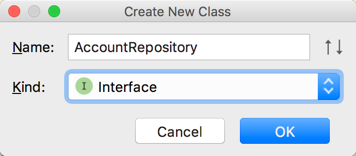

# Account Repository

### This page: https://github.com/ted-ncg/labs/blob/master/04-account-repository.md

## Goal

Have a way of storing and finding accounts in memory, behind a single interface.

## Steps

Be sure to skim through all of the steps before getting started.

### A. Give Account Identity

This will make an Account an *Entity*.

1. Add a `Long id` private member variable to the `Account` class.

   * **IMPORTANT:** Make sure you name the member variable exactly this way, as a `Long` with the name `id` (all lower-case).

1. Create a getter & setter for the `id` property.

   * Use IntelliJ to generate the getter & setter using `Command + N` (Mac) or `Alt + Insert` (Windows)

### B. Create Repository Interface

Create a new *interface* named `AccountRepository` (using `New > Java Class` from the menu)



Add the following code:

```java
public interface AccountRepository {

  Account findOne(Long id);
  
  Account save(Account entity);
  
  List<Account> findAll();

}
```

### C. Create AccountRepository Implementation

1. Create a new *class* named `FakeAccountRepository` that implements the `AccountRepository` interface and start with the following code:

    ```java
    public class FakeAccountRepository implements AccountRepository {
    
      public FakeAccountRepository() {}
      
      public FakeAccountRepository(Account... accounts) {
        // You can iterate through the accounts array like this:
        for (Account account : accounts) {
          // process each account here
        }
        // You can also convert it directly to a List:
        // See: https://docs.oracle.com/javase/8/docs/api/java/util/Arrays.html#asList-T...-
        List<Account> accountList = Arrays.asList(accounts);
      }
  
      public Account findOne(Long id) {
        throw new UnsupportedOperationException(); 
      }
  
      public Account save(Account entity) {
        throw new UnsupportedOperationException(); 
      }
  
      public List<Account> findAll() {
      }
  
    }
    ```

1. Implement the `findAll()` method (**remember** to write failing tests first):

   > NOTE: Put tests for `findAll` into a new Test class named `AccountRepositoryFindTest`

   * If there are no accounts, return an *empty* `List`
   
     * What test would you write for this?
   
   * If there are accounts, return all of them in a `List`

     * Use this test to get you started:   
       ```java
       @Test
       public void findAllShouldReturn2Accounts() {
         Account account1 = new Account();
         account1.setId(1L);
         Account account2 = new Account();
         account2.setId(2L);
       
         AccountRepository repo = new FakeAccountRepository(account1, account2);
         assertThat(repo.findAll())
           .hasSize(2);
       }
       ```
   * Make sure all tests **pass** before continuing.

1. Implement the `findOne()` method (**remember** to write failing tests first):

   > NOTE: Add tests for `findOne` into `AccountRepositoryFindTest`

   * **Think:** What is appropriate Java Collection class to use to store the accounts so that it's easy to find `Account`'s by their `id`?

   * If there's no `Account` with that `id`, return `null`.
   * If there exists an `Account` with the given `id`, return it
   * Make sure all tests **pass** before continuing.

1. Implement the `save()` method, which stores the given account in the repository so it can be found later.

   > NOTE: Put tests for `save` into a new Test class named `AccountRepositorySaveTest`

   * If the incoming account object's `id` property is ALREADY set, DON'T modify it, just store it.
      
   * If the account came in with NO `id` (`null`), SET it with a UNIQUE one that the repository generates
   
     * **Think:** How will you guarantee uniqueness?
      
   * Return the Account object that must now have its id set (i.e., is NOT null)

   * Here's a test to use to ensure that each newly saved Account is given an ID that's different from other newly saved Accounts.
  
      ```java
      @Test
      public void newlySavedAccountsHaveUniqueIds() {
        AccountRepository accountRepository = new FakeAccountRepository();
        Account account1 = new Account();
        account1 = accountRepository.save(account1);
        Account account2 = new Account();
        account2 = accountRepository.save(account2);
      
        assertThat(account1.getId())
            .isNotEqualTo(account2.getId());
      }
      ```

----

### Negative Tests

* Be sure and think about other *negative* tests that you can add and write them!

----


## STOP

Don't go further until you've checked in with the instructor.

----

## Optional

1. Implement the "delete" functionality by adding the following method to the `AccountRepository` interface:

    ```java
    void delete(Account account);
    ```

1. Implement the following behavior in your `FakeAccountRepository`, remember to write a failing test **first**:

   > NOTE: Put tests for `delete` into a new Test class named `AccountRepositoryDeleteTest`
  
   * Deleting an account means that trying to find it by its `id` will return `null` -- as if the account was never saved.
    
     > NOTE: Don't modify the account object that's being deleted -- it will continue to have the id that was assigned upon `save`
    
   * If `null` reference for the `Account` is passed in, throw an `IllegalArgumentException`
    
   * If an `Account` with an `id` that's not found is passed in, throw an `IllegalArgumentException` 
  
----


## STOP

If you're done, have the instructor review your code.

----  

## References

Article: ["Mocks Aren't Stubs"](https://www.martinfowler.com/articles/mocksArentStubs.html) by Martin Fowler

Book: [xUnit Test Patterns](https://martinfowler.com/books/meszaros.html) by Gerard Meszaros

