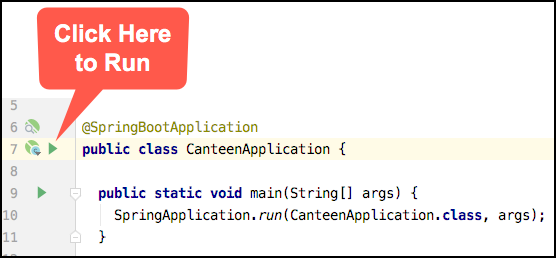

# Spring REST Controller

### This page: https://github.com/ted-ncg/labs/blob/master/05-spring-mvc-rest.md

## Goal

In this lab you will implement a "RESTful" API for retrieving information about a specific account,
using Spring's MVC framework.

### Reference

**Useful reference for annotations**: http://engineering.pivotal.io/post/must-know-spring-boot-annotations-controllers/

**Full Spring Docs**: https://docs.spring.io/spring/docs/5.1.8.RELEASE/spring-framework-reference/web.html#mvc-ann-requestmapping

## More Logging

So you can see logging related to mapping your endpoints, add the following two lines to the `application.properties` file:

```
logging.level.org.springframework.web.servlet.mvc.method.annotation.RequestMappingHandlerMapping=TRACE
logging.level.web=DEBUG
```

## A. Create Failing Test

Create a new test class as shown below. Note that it will not yet compile (nor pass):

```java
package com.visa.ncg.canteen;

import org.junit.Test;

import static org.assertj.core.api.Assertions.assertThat;

public class AccountApiControllerTest {

  @Test
  public void accountInfoReturnsAccountWithSpecifiedId() throws Exception {
    AccountApiController controller = new AccountApiController();

    Account account = controller.accountInfo("123");

    assertThat(account.getId())
        .isEqualTo(123L);
  }

}
```

## B. Create the REST Controller Class

1. Create a class named `AccountApiController`

1. Add the `@RestController` annotation above the `class` definition:

   ```java
   @RestController
   public class AccountApiController {
   }
   ```

## C. Implement accountInfo Method

1. Inside the `AccountApiController` class, add an `accountInfo` method:

    ```java
    public Account accountInfo(String accountId) { 
    }
    ```

1. Inside this `accountInfo` method, create a **new** `Account` object

1. Set the account's ID to the `accountId` parameter

    * **Note:** you will need to convert from the `accountId` as a `String` to a `Long`.
      You can use `Long.parseLong()` to do this.

1. Add `13` to the account's balance via the `deposit()` method

1. Return this new `Account` object

1. Run the test that you added in Step A (the `accountInfoReturnsAccountWithSpecifiedId` test). It should now **PASS**.

## C. Create Method for GET Request

Now you'll annotate the method so that it can be used via an HTTP `GET` to the URL `http://localhost:8080/api/accounts/123`. 

1. Inside the `AccountApiController` class, add a `@GetMapping` annotation to the `accountInfo` method
   that matches the URL of `http://localhost:8080/api/accounts/123` 

    >**GET MAPPING EXAMPLE**
    >
    > *DO NOT COPY-AND-PASTE THIS*
    >
    >This method would be invoked if a *GET* came in to the path `http://localhost:8080/users/999`
    >
    > ```java
    > @GetMapping("/users/{id}")
    > public User showUser(...) {...}
    > ```

1. Add a `@PathVariable` annotation before the `accountId` parameter so that it matches the *URI variable* in the
   `@GetMapping` that you used above.

    >**PATH VARIABLE EXAMPLE**
    >
    > *DO NOT COPY-AND-PASTE THIS*
    >
    >This extracts the `id` variable from the path and puts it in the `userId` parameter
    >
    >```java
    >@GetMapping("/users/{id}")
    >public User showUser(@PathVariable("id") String userId) {...}
    >```

## D. Try it Out    

1. Run the `CanteenApplication` from within IntelliJ IDEA:

   * Right click on the `CanteenApplication` class and then select "Run...", or you can click on the green arrow:
   
      
 
   * Once you see something like the following, you can go to the next step:

   ```
   2017-08-27 09:37:21.351  INFO 11472 --- [  Main] s.b.c.e.t.TomcatEmbeddedServletContainer : Tomcat started on port(s): 8080 (http)
   2017-08-27 09:37:21.355  INFO 11472 --- [  Main] com.visa.ncg.canteen.CanteenApplication  : Started CanteenApplication in 3.433 seconds (JVM running for 4.064)
   ```

1. Make a request against the endpoint in your browser by going to this URL:

    `http://localhost:8080/api/accounts/123`

1. You should see something like

    ```json
    {"id": 123}
    ```

## Questions

* Why is only `id` in the output and not `balance`?

* What happens if you use letters for the account ID instead of numbers? For example:

    `http://localhost:8080/api/accounts/123abc`

----

>  Once you've completed the above steps, you're done, so let the instructor know.

----

## Reference

This is a full example of a *Controller* "endpoint":
  
```java
package com.visa.ncg.canteen;

import org.springframework.web.bind.annotation.*;

@RestController
public class HelloController {

  @GetMapping("/api/hello/{text}")
  public String sayHelloTo(@PathVariable("text") String name) {
    return "Hello " + name;
  }
}  
```
