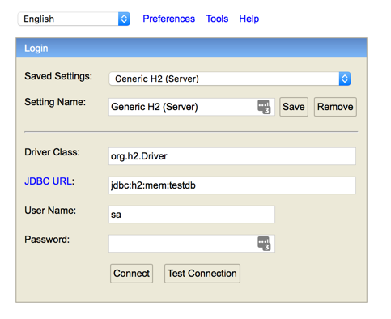
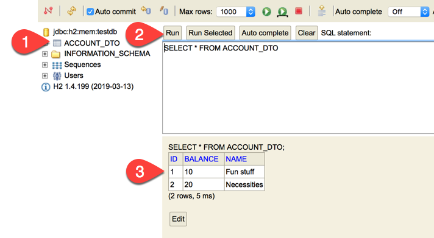

# Use Spring Data's JPA Repository

### This page: https://github.com/ted-ncg/labs/blob/master/15-jpa-repository-adapter.md

----

## Goal 

Create a JPA implementation of the `AccountRepository` that uses Spring Data to store Accounts in a database.

## Preparation

1. Add the following dependencies to the `pom.xml` file inside the `<dependencies>` section:

        <dependency>
            <groupId>org.springframework.boot</groupId>
            <artifactId>spring-boot-starter-data-jpa</artifactId>
        </dependency>
        <dependency>
            <groupId>com.h2database</groupId>
            <artifactId>h2</artifactId>
        </dependency>

1. Exit IntelliJ IDEA 

1. Open up a command line prompt and change to the directory where your project is located.

1. From the command-line, do a `mvn compile`, like this (copy-n-paste the whole line):

   ```
   mvn compile -Dmaven.wagon.http.ssl.insecure=true -Dmaven.wagon.http.ssl.allowall=true -Dmaven.wagon.http.ssl.ignore.validity.dates=true
   ```
   
   This may take a little while as it has to download the Spring Data dependencies.
   
1. Re-open IntelliJ IDEA and open the project and make sure all of the tests compile and pass before moving on.

    * You may need to "refresh" (or re-import) the Maven file:
      open the Maven window (on the right side) and click on the left-most icon
      (Reimport All Maven Projects).

## A. Create Entity and JPA Repository Interface

1. Copy the [AccountDto.java](AccountDto.java) class into your production code directory.

1. First, you'll create a Spring Data Repository by creating a new *interface* as follows:

    ```java
    public interface AccountJpaRepository extends CrudRepository<AccountDto, Long> {
    }
    ```

   This is all that's needed, Spring Data generates the database code for you.

## B. Implement the Repository Adapter

Now that you have a database implementation (provided by Spring Data), you need to connect the Account Repository
interface to the Spring Data implementation.

1. Create an *Adapter* class called `AccountJpaRepositoryAdapter` that implements the `AccountRepository` interface
   and has the `@Repository` and `@Primary` annotations:

    ```java
    @Primary
    @Repository
    public class AccountJpaRepositoryAdapter implements AccountRepository {
    }
    ```

1. In this adapter, create a constructor to accept an *injected* (auto-wired) instance of `AccountJpaRepository`

1. In this adapter, implement the three `AccountRepository` methods, 
   converting from the domain `Account` objects to `AccountDto` objects that can be stored in the database.
   
   >Note: The `AccountDto` class has two conversion methods already written: `asAccount` and `from`
   >that you can use to convert between AccountDto (DTO) objects and Account (domain) objects.
   
   For example: 

    ```java
    @Override
    public Account findOne(Long id) {
      AccountDto dto = accountJpaRepository.findById(id).get(); // extract from Optional
      return dto.asAccount(); // convert from DTO to Account (domain) object
    }    
    ```

    Now implement `findAll()` and `save()`, delegating to those methods in the `AccountJpaRepository` instance.

----

## C. Try It Out

Try out the application, everything should continue to work as before!

You can see the database tables by opening up a browser and going to:

```
localhost:8080/h2-console
```

You'll see a login window like this:



* Click on **Test Connection** and make sure you can connect

* Click on **Connect** 

You'll then see a window like this:



To query the database:

1. Click on ACCOUNT_DTO (this will create a `SELECT *` statement) **(1)**

1. Click on the **Run** button **(2)**

1. You'll see the contents of the Accounts in the table **(3)**

----

# Extra Information

Spring Data (JPA) makes it very easy to add new query (find) methods *without writing any code*.

## Query by Name

Find by name: `List<Account> findByName(String name)`

Docs: https://docs.spring.io/spring-data/jpa/docs/current/reference/html/#repositories.query-methods.query-creation

---

### Custom queries

You can also write custom queries without writing much code
 
Docs: https://docs.spring.io/spring-data/jpa/docs/current/reference/html/#repositories.custom-implementations
